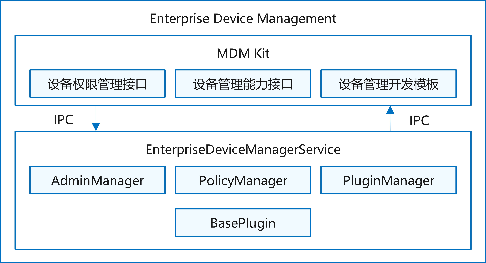

# 企业设备管理组件介绍

## 简介

企业设备管理组件给企业MDM（Mobile Device Management）应用开发者提供管理应用开发框架，设定管理模式以及提供企业设管理功能能力集。为企业环境下的应用提供系统级别的管理功能API。

## 系统架构

**图 1**  企业设备管理组件架构图 



企业设备管理组件架构图说明：

- Edm Kit为开发者提供MDM应用开发框架，并面向系统应用提供设备管理权限接口，同时面向三方应用提供设备管理能力接口。
- 企业设备管理服务（EnterpriseDeviceManagerService）：管理企业场景下的MDM应用、设备管理策略和实现设备管理能力的系统服务。
  - 管理员管理模块（AdminManager）负责维护各个设备管理员应用的信息。
  - 策略管理模块（PolicyManager）负责管理和持久化企业设置的管控策略。
  - 插件管理模块（PluginManager）负责设备管理能力插件的加载和管理。
  - 基础设备管理能力插件（BasePlugin）负责提供OS基础的设备管理能力。

## 目录

企业设备管理组件源代码目录结构如下所示：

````
/base/customization/enterprise_device_management
├── common                   # 公共代码
├── etc                      # 组件包含的进程的配置文件
├── interfaces               # EdmKits代码
│   └── innerkits            # 子系统接口
│   └── kits                 # 开发者接口
├── profile                  # 组件包含的系统服务的配置文件
└── services                 # 企业设备管理服务实现
```
````

## 说明

设备管理组件提供了企业设备管理应用开发模板，支持设备管理应用激活、安全策略设置、系统配置和管理。

## 相关仓

[admin_provisioning](https://gitee.com/openharmony/applications_admin_provisioning)

[appexecfwk_standard](https://gitee.com/openharmony/appexecfwk_standard)

